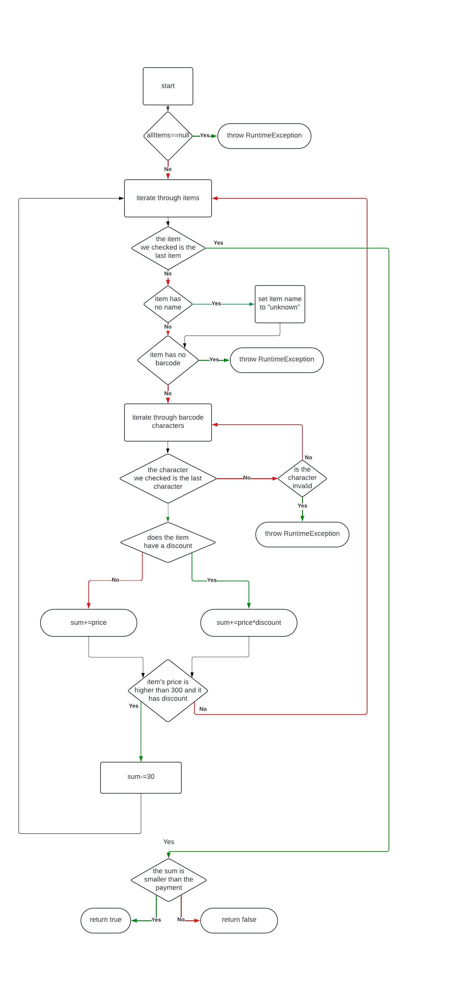

Sofija Tasevska 226010

cyclomatic_compexity(G)=|edges|-|verticies|+2|connected_components|

-> 25-21+2=6
Цикломатската сложеност го претставува бројот на линеарно независни патишта низ програмата. Резултатот за комплексноста на оваа програма според горенаведената формула е 6, што значи постојат 6 патишта.
(Условот цената да е поскапа од 300, попустот поголем од 0 и баркодот да почнува на 0 во контекст на објаснувањето ќе го нарекувам специјален услов.)
1. Валидни продукти без попуст.
2. Валидни продукти со попуст без специјален услов.
3. Валидни продукти со попуст со специјален услов.
4. Продукти со невалиден баркод.
5. Продукти без баркод.
6. Програма без внес на продукти.

За да го задоволиме Every Branch критериумот, мора да дадеме доволно примери да ги поминеме сите гранки.
Најмалиот број на тест примери што задолжително мора да бидат понудени за да се задоволни еvery branch условот е 6 (празна низа продукти, продукт без баркод, продукт со невалиден баркод и 2 за надминување или ненадминување на трошоците, а во шестиот пример да вклучиме продукт без попуст, и два продукти со попуст, едниот со, а другиот без специјален услов, од кои што едниот мора да има име поставено на null или празен стринг).

1. allItems == null
input : allItems=null, payment=100

2. Продукт со име означено како null или без име
input: allItems = [new Item(null,"123",100,0)], payment=50

3. Продукт без баркод
input: allItems = [new Item("hi",null,100,0)], payment=50

4. Продукт со невалиден баркод
input: allItems = [new Item("hi","hehe",100,0)], payment=80

5. Продукт со попуст, без специјален услов
input: allItems = [new Item("hi","123",100,0.7)], payment=100

6. Продукт со попуст, со специјален услов
input: allItems = [new Item("hi","0123",500,0.8)], payment=600

7. Продукт без попуст
input:  allItems = [new Item("hi","0123",60,0)], payment=70

8. Повеќе продукти чија цена не ја надминува сумата во payment
input: allItems = [new Item("Item1", "88", 100, 0), new Item("Item2", "44", 200, 0)], payment = 600

9. Повеќе продукти чија цена ја надминува сумата во payment
input: allItems = [new Item("Item1", "88", 800, 0), new Item("Item2", "44", 200, 0.9)], payment = 500

Со овие тест примери ќе може да ги изминеме со сигурност сите ребра. Ако нема продукти (1), ќе биде фрлен Exception, ако некој продукт нема име, ќе се именува "unknown" (2), а дел од примерите ќе покажат и како ако продуктот нема баркод (3) или има невалиден баркод (4) исто така би се фрлил Exception. Соодветно, мора да постојат продукти кои ќе ги задоволат овие услови за да ги испитаме останатите гранки. Мора да испитаме и како програмата се справува со продуктите кои имаат и немаат попуст(7), а ако продуктот има попуст, со тест примерот под 6 ќе видиме како програмата работи и при специјален услов, а со 5 како работи кога продукт нема специјален услов. На крајот имаме 2 разгранувања, сума помала или еднаква на наплатата, и сума која ја надминува. За да видиме како работи програмата и во вакви услови, ги додаваме примерите 8 и 9. Бројот на тест примери може да биде и помал така што во колекцијата на продукти би ставиле продукти без имиња, продукти без и со попуст. 

За да биде задоволен multiple condition условот, мора да ги тестираме сите можни комбинации во специјалниот услов.

item.getPrice() > 300
item.getDiscount() > 0
item.getBarcode().charAt(0) == '0'

1. Сите да се вистинити. 
Input: Item("hehe", "01", 100, 0.1)

2. Првиот услов е неточен, останатите точни.
Input: Item("hehe", "02", 30, 0.7)

3. Вториот услов е неточен, останатите точни.
Input: Item("hehe", "03", 50, 0)

4. Третиот услов е неточен, останатите точни.
Input: Item("hehe", "4", 50, 0.4)

5. Само првиот услов е точен.
Input: Item("hehe", "2", 3000, 0)

6. Само вториот услов е точен.
Input: Item("hehe", "2", 30, 0.7)

7. Само третиот услов е точен
Input: Item("hehe", "02", 60, 0)

8. Ниту еден услов не е точен
Input: Item("hehe", "79", 10, 0)

